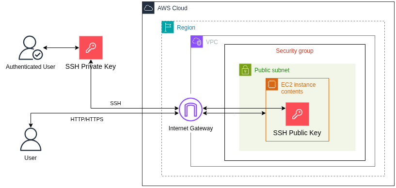
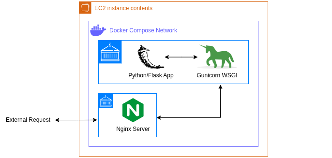
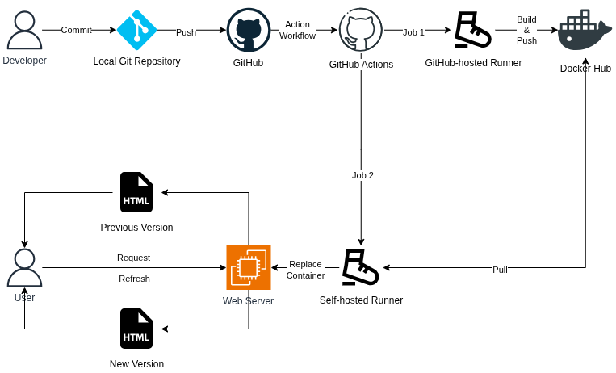

# DevOps Workflow Project

**Dublin Business School**  
**MSc in Information Systems with Computing**  
**Network Systems and Administration - B9IS121**  
**Year 1, Semester 1**  
**Continuous Assessment 1**

**Lecturer name:** Kingsley Ibomo

**Student Name:** Mateus Fonseca Campos  
**Student Number:** 20095949  
**Student Email:** 20095949@mydbs.ie

**Submission date:** 9 November 2025

This repository contains a DevOps workflow developed for my Network Systems and Administration CA 1 at Dublin Business School - MSc in Information Systems with Computing, Year 1, Semester 1.

## Part 1: Requirements and Setup

**Cloud Service Provider:** this project requires an [AWS account](https://aws.amazon.com/free/). Make sure to install [the AWS CLI](https://docs.aws.amazon.com/cli/latest/userguide/getting-started-install.html) and to set your [security credentials](https://docs.aws.amazon.com/IAM/latest/UserGuide/security-creds.html) to allow you to create resources in your preferred region. Required resources include SSH key pairs, security groups, and EC2 instances.

**Infrastructure-as-Code Tool:** this project requires the [Terraform CLI](https://developer.hashicorp.com/terraform/tutorials/aws-get-started/install-cli). Make sure to set the following environment variables, as Terraform needs them to communicate with AWS:

```console
$ export AWS_ACCESS_KEY_ID=<replace with your AWS access key>
$ export AWS_SECRET_ACCESS_KEY=<replace with your AWS secret key>
```

**Configuration Management Tool:** this project requires [Ansible](https://docs.ansible.com/ansible/latest/installation_guide/intro_installation.html).

**Containerization Tool:** this project requires [Docker](https://docs.docker.com/engine/install/) and a [Docker Hub account](https://hub.docker.com/). Make sure to [create a personal access token](https://docs.docker.com/security/access-tokens/) for your Docker Hub account.

**GitHub Repository:** this project requires a [fine-grained personal access token](https://docs.github.com/en/authentication/keeping-your-account-and-data-secure/managing-your-personal-access-tokens) for your GitHub account with access to the project's repository. Also make sure to set DOCKERHUB_PROJECT_NAME, DOCKERHUB_TOKEN, and DOCKER_USERNAME as [repository secrets under Actions](https://docs.github.com/en/actions/how-tos/write-workflows/choose-what-workflows-do/use-secrets), so that they can be used by the CI/CD workflow.

**Environment File:** create a file called *.env* at the root of the project with the following content, which will be used by Ansible:

```
DOCKER_USERNAME=<replace with your Docker username>
DOCKERHUB_TOKEN=<replace with you Docker Hub personal access token>
GITHUB_PERSONAL_ACCESS_TOKEN=<replace with your GitHub personal access token>
```

## Part 2: Breakdown

This project was developed following DevOps principles and can be divided into four parts:

- **1. Infrastructure Setup**  
Terraform deploys infrastructure to AWS:
    ```
    terraform/
    ├── .terraform.lock.hcl
    ├── main.tf
    ├── terraform.tf
    ├── terraform.tfstate
    └── terraform.tfstate.backup
    ```
  - **1.1. .terraform.lock.hcl**  
  This autogenerated file keeps track of all providers installed by Terraform.
  - **1.2. main.tf**  
  This file lists all resources that Terraform will deploy:
    - **1.2.1. data "local_sensitive_file" "public_key"**  
    Reads SSH public key from local file.
    - **1.2.2. resource "aws_key_pair" "key_pair"**  
    Deploys an AWS key pair using the public key from the previous step.
    - **1.2.3. resource "aws_security_group" "allow_http_https_ssh"**  
    Deploys an AWS security group.
    - **1.2.4. resource "aws_vpc_security_group_ingress_rule" "allow_inbound_http_ipv4"**  
    Deploys an AWS inbound security rule that allows all HTTP traffic on port 80.
    - **1.2.5. resource "aws_vpc_security_group_ingress_rule" "allow_inbound_https_ipv4"**  
    Deploys an AWS inbound security rule that allows all HTTPS traffic on port 443.
    - **1.2.6. resource "aws_vpc_security_group_ingress_rule" "allow_inbound_ssh"**  
    Deploys an AWS inbound security rule that allows all SSH traffic on port 22.
    - **1.2.7. resource "aws_vpc_security_group_egress_rule" "allow_outbound_all"**  
    Deploys an AWS outbound security rule that allows all traffic on all ports.
    - **1.2.8. resource "aws_instance" "net_ca1_server"**  
    Deploys an AWS EC2 instance and associates it with the previously created key pair and security group.
    - **1.2.9. resource "null_resource" "update_ansible_inventory"**  
    Passes the IPv4 address of the newly deployed EC2 instance to the Ansible inventory file.
  - **1.3. terraform.tf**  
  This file lists all providers that Terraform will install:
    - **1.3.1. aws**  
    Amazon Web Services (AWS): the cloud infrastructure provider.
    - **1.3.2. local**  
    Terraform module for handling local files.
    - **1.3.3. tls**  
    Terraform module for handling encryption tasks.
    - **1.3.4. http**  
    Terraform module for handling HTTP requests.
    - **1.3.5. null**  
    Terraform module for performing operations without creating/destroying resources.
  - **1.4. terraform.tfstate**  
  This autogenerated file keeps track of all resources deployed by Terraform.
  - **1.5. terraform.tfstate.backup**  
  This autogenerated file is a backup of the previous one.

- **2. Configuration Management**  
Ansible connects to EC2 instance and configures its environment:
    ```
    ansible/
    ├── inventory.yaml
    ├── playbook_cicd.yaml
    ├── playbook_deployment.yaml
    └── playbook_setup.yaml
    ```
  - **2.1. inventory.yaml**  
  This file lists all hosts Ansible can connect to:
    - **2.1.1. aws_ec2**
    This is the web server running the application. It can be connected to via SSH, using a key pair. Its IPv4 address is automatically populated by Terraform upon deployment.
  - **2.2. playbook_cicd.yaml**  
  This file defines the tasks to be carried out by the self-hosted runner:
    - **2.2.1. Download and install runner**  
    Downloads and installs the self-hosted runner onto the web server. It uses variable GITHUB_PERSONAL_ACCESS_TOKEN from the .env file.
    - **2.2.2. Install and start runner service**  
    Installs the self-hosted runner as a service and starts it, so that it can listen for and pick up GitHub Actions jobs.
  - **2.3. playbook_deployment.yaml**  
  This file defines the tasks to be carried out when deploying Docker containers to the web server:
    - **2.3.1. Build and push Docker image**  
    This task runs on the local host. It builds a Docker image from the application using the Dockerfile, and pushes it to Docker Hub. It uses variables DOCKER_USERNAME and DOCKERHUB_TOKEN from the .env file.
    - **2.3.2. Create Nginx directory**  
    This task creates a directory to house the Nginx file(s) on the web server.
    - **2.3.3. Create Docker directory**  
    This task creates a directory to house the Docker compose file on the web server.
    - **2.3.4. Copy Docker and Nginx files**  
    This task copies the Docker compose file and the Nginx configuration file from the local host to the remote host.
    - **2.3.5. Pull and run Docker image**  
    This task pulls and runs the latest Docker images from Docker Hub, following instructions from the Docker compose file. It uses variables DOCKER_USERNAME and DOCKERHUB_TOKEN from the .env file.
  - **2.4. playbook_setup.yaml**  
  This file defines the tasks to be carried out when configuring the web server environment to run Docker:
    - **2.4.1. Set up**  
    This task adds the Docker repository to the apt sources.
    - **2.4.2. Install**  
    This task installs all required Docker packages.
    - **2.4.3. Start**  
    This task starts the Docker service and sets it to autostart on reboot.

- **3. Docker Container Deployment**  
Docker builds images and composes containers for the Python/Flask app and the Nginx proxy server:
    ```
    .
    ├── docker/
    │   └── compose.yaml
    ├── flask/
    │   ├── app.py
    │   ├── Dockerfile
    │   └── requirements.txt
    └── nginx/
        └── default.conf
    ```
  - **3.1. compose.yaml**  
  This file tells Docker to run two containers inside the same network:
    - **3.1.1. app**
    Python/Flask app container runs the application code on port 8000.
    - **3.1.2. proxy**
    Nginx proxy container runs a proxy server on port 80, upstreaming to port 8000.
  - **3.2. app.py**  
  This file defines a simple modified hello-world Python/Flask application, which can be easily toggled between code versions 1 and 2 to demonstrate the CI/CD workflow.
  - **3.3. Dockerfile**  
  This file tells Docker to run the application on Ubuntu 22.04 with all dependencies installed, while exposing port 8000 via Gunicorn for WSGI-HTTP translation.
  - **3.4. requirements.txt**  
  This file lists all application dependencies that will be installed by Docker.
  - **3.5. default.conf**  
  This file contains basic configuration for the Nginx proxy server, i.e. listen to HTTP traffic on port 80 and upstream it to the app server on port 8000.

- **4. CI/CD Pipeline Integration**  
GitHub Actions builds and deploys the latest app image upon a push to the master branch:
    ```
    .github/
    └── workflows/
        └── cicd.yml
    ```
  - **4.1. cicd.yml**   
  This file describes the jobs to be carried out by GitHub Actions:
    - **4.1.1. Build and Push Docker Image**
    GitHub-hosted runner builds a new image from the newly pushed app code and pushes the image to Docker Hub.  
    - **4.1.2. Pull and run Docker Image**
    Self-hosted pulls the latest images, stops and removes the running containers, and composes them up again using the newly pulled images.  

## Part 3: Run Project

The easiest way to run the project is simply:

```console
$ # Deploy all
$ bash run_project.sh

$ # Destroy all
$ bash run_project.sh --clean-up

$ # Display help
$ bash run_project.sh --help
```

If each step must run individually, then:

```console
$ # Generate SSH key pair
$ ssh-keygen -t rsa -b 4096 -f "net_ca1_key.pem"
$ chmod 0400 "net_ca1_key.pem"

$ # Terraform deploy infrastructure
$ cd terraform
$ terraform init
$ terraform apply

$ # Terraform destroy infrastructure
$ cd terraform
$ terraform destroy

$ # Ansible configure web server
$ cd ansible
$ ansible-playbook -i inventory.yaml playbook_setup.yaml

$ # Ansible deploy Docker
$ cd ansible
$ ansible-playbook -i inventory.yaml playbook_deployment.yaml

$ # Ansible install self-hosted runner
$ cd ansible
$ ansible-playbook -i inventory.yaml playbook_cicd.yaml
```

After running the commands above, the infrastructure is deployed, the server is configured, and the CI/CD pipeline is enabled. Any subsequent pushes to the GitHub repository will trigger a new application deployment, after which, simply refreshing the web page should load the new version of the application.

## Part 4: Diagrams

|  |
| :-: |
| *Infrastructure* |

|  |
| :-: |
| *Docker Compose* |

|  |
| :-: |
| *CI/CD Pipeline* |

## Part 5: References

Below is a list of the official documentation resources used to complete this project:

- **[AWS Docs](https://docs.aws.amazon.com/)**
    - [Key pairs](https://docs.aws.amazon.com/AWSEC2/latest/UserGuide/ec2-key-pairs.html)
    - [Security groups](https://docs.aws.amazon.com/vpc/latest/userguide/vpc-security-groups.html)
    - [EC2](https://docs.aws.amazon.com/AWSEC2/latest/UserGuide/concepts.html)
    - [Default VPC](https://docs.aws.amazon.com/appstream2/latest/developerguide/default-vpc-with-public-subnet.html)
- **[Ansible Docs](https://docs.ansible.com/)**
    - [Playbooks](https://docs.ansible.com/ansible/latest/playbook_guide/playbooks_intro.html)
    - [Inventory](https://docs.ansible.com/ansible/latest/inventory_guide/intro_inventory.html)
    - [Shell module](https://docs.ansible.com/ansible/latest/collections/ansible/builtin/shell_module.html)
    - [Delegation](https://docs.ansible.com/ansible/latest/playbook_guide/playbooks_delegation.html)
    - [File module](https://docs.ansible.com/ansible/latest/collections/ansible/builtin/file_module.html)
    - [Copy module](https://docs.ansible.com/ansible/latest/collections/ansible/builtin/copy_module.html)
    - [File lookup](https://docs.ansible.com/ansible/latest/collections/ansible/builtin/file_lookup.html)
    - [Variables](https://docs.ansible.com/ansible/latest/playbook_guide/playbooks_variables.html)
- **[Docker Docs](https://docs.docker.com/)**
    - [Dockerfile](https://docs.docker.com/build/concepts/dockerfile/)
    - [Compose](https://docs.docker.com/compose/gettingstarted/)
    - [Networking](https://docs.docker.com/compose/how-tos/networking/)
    - [Personal access tokens](https://docs.docker.com/security/access-tokens/)
- **[Flask Docs](https://flask.palletsprojects.com/en/stable/)**
    - [Quickstart](https://flask.palletsprojects.com/en/stable/quickstart/)
    - [Deploying](https://flask.palletsprojects.com/en/stable/deploying/)
- **[GitHub Docs](https://docs.github.com/en)**
    - [Self-hosted runners](https://docs.github.com/en/actions/reference/runners/self-hosted-runners)
    - [REST API for self-hosted runners](https://docs.github.com/en/rest/actions/self-hosted-runners?apiVersion=2022-11-28)
    - [Personal access token](https://docs.github.com/en/authentication/keeping-your-account-and-data-secure/managing-your-personal-access-tokens)
    - [Secrets for GitHub Actions](https://docs.github.com/actions/security-guides/using-secrets-in-github-actions)
- **[Nginx Docs](https://nginx.org/en/docs/)**
    - [HTTPS Servers](https://nginx.org/en/docs/http/configuring_https_servers.html)
- **[Terraform Registry](https://registry.terraform.io/)**
    - [tls_private_key (Resource)](https://registry.terraform.io/providers/hashicorp/tls/latest/docs/resources/private_key)
    - [local_sensitive_file (Resource)](https://registry.terraform.io/providers/hashicorp/local/latest/docs/resources/sensitive_file)
    - [Resource: aws_key_pair](https://registry.terraform.io/providers/hashicorp/aws/latest/docs/resources/key_pair)
    - [tls_private_key (Ephemeral Resource)](https://registry.terraform.io/providers/hashicorp/tls/latest/docs/ephemeral-resources/private_key)
    - [local_sensitive_file (Data Source)](https://registry.terraform.io/providers/hashicorp/local/latest/docs/data-sources/sensitive_file)
    - [Resource: aws_security_group](https://registry.terraform.io/providers/hashicorp/aws/latest/docs/resources/security_group)
    - [Resource: aws_vpc_security_group_ingress_rule](https://registry.terraform.io/providers/hashicorp/aws/latest/docs/resources/vpc_security_group_ingress_rule)
    - [http (Data Source)](https://registry.terraform.io/providers/hashicorp/http/latest/docs/data-sources/http)
    - [Resource: aws_vpc_security_group_egress_rule](https://registry.terraform.io/providers/hashicorp/aws/latest/docs/resources/vpc_security_group_egress_rule)
    - [Resource: aws_instance](https://registry.terraform.io/providers/hashicorp/aws/latest/docs/resources/instance)
    - [null_resource](https://registry.terraform.io/providers/hashicorp/null/latest/docs/resources/resource)

## Part 6: Copyright Disclaimer

This project may feature content that is copyright protected. Please, keep in mind that this is a student's project and has no commercial purpose whatsoever. Having said that, if you are the owner of any content featured here and would like for it to be removed, please, contact me and I will do so promptly.

Thank you very much,  
Mateus Campos.